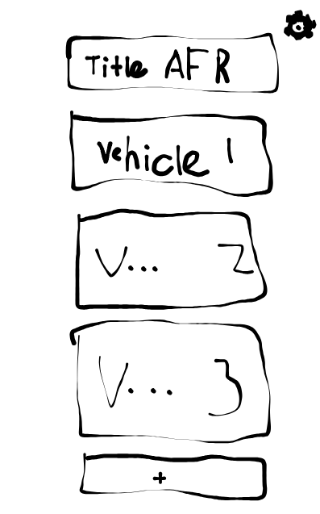
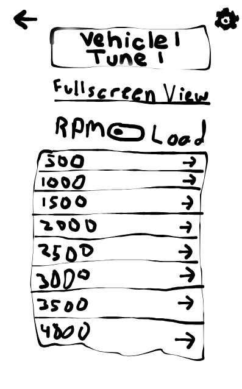
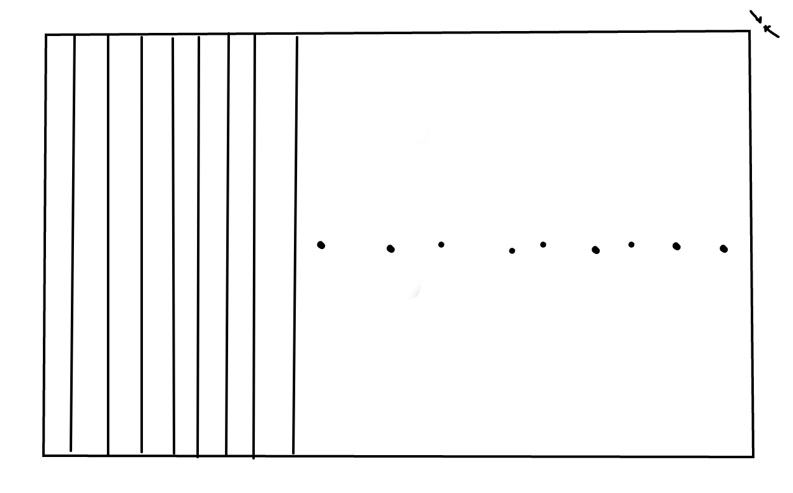

#Project 2 - Mobile Tuning System

In redesigning the AFR table for our application, I adhered closely to Apple’s Human Interface Guidelines to ensure both usability and accessibility. Previously, the data was presented in a plain ScrollView with a dense table, which lacked context, hierarchy, and clarity. Following the HIG’s emphasis on clarity and deference, I implemented a dynamic grid layout with clearly labeled rows and columns that adapt to the device’s screen size and orientation. Each AFR cell is color-coded based on its value, providing immediate visual feedback while maintaining a clean and unobtrusive interface. This aligns with the guideline that “a well-ordered hierarchy and consistent visual language help users understand content quickly,” as it allows users to recognize trends and outliers at a glance without cognitive overload.

Additionally, I incorporated interactive affordances that reflect HIG recommendations for intuitive and direct manipulation. Users can tap either a row or column to edit its values, which triggers a dedicated editing page with pre-populated data. This reduces errors and supports focused interactions, consistent with Apple’s principle that “touch targets should be clear, responsive, and forgiving.” The inclusion of a fullscreen mode in landscape orientation further leverages the screen real estate while keeping the interface uncluttered, following HIG guidance on adaptable layouts that enhance task completion without overwhelming the user.

Finally, the updated interface prioritizes accessibility and role-based interaction, as suggested by Apple’s guidelines for inclusivity. Viewers are prevented from editing, while editors and admins have full access, with visual cues and button states reflecting current permissions. The layout respects safe area insets, ensures text contrast meets accessibility standards, and preserves logical navigation patterns. By combining these design choices—hierarchy, visual clarity, intuitive interactions, and adaptive layouts—the AFR table interface is not only functional but also adheres to Apple’s HIG, creating a professional, usable experience on iOS devices.